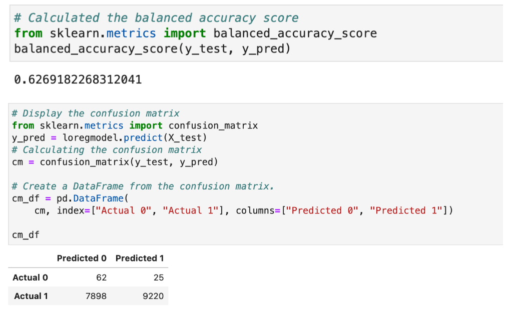
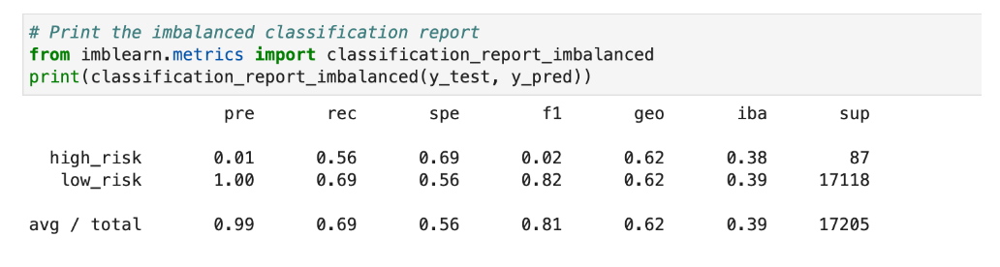
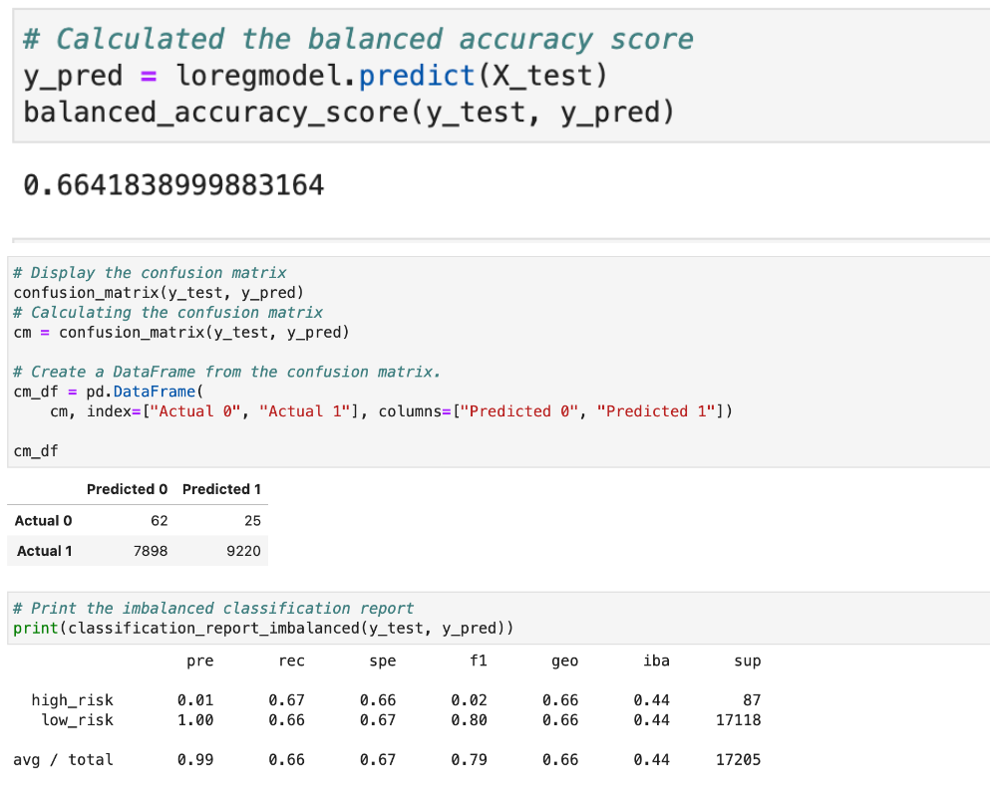
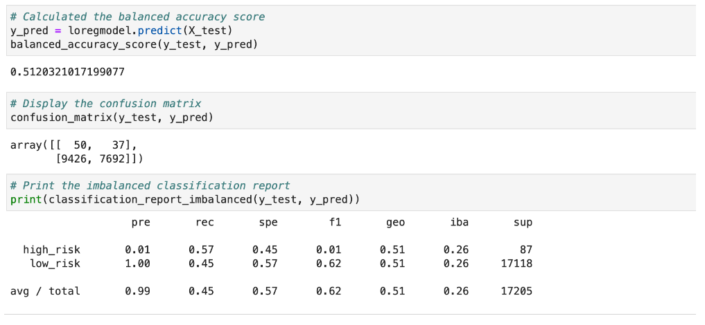
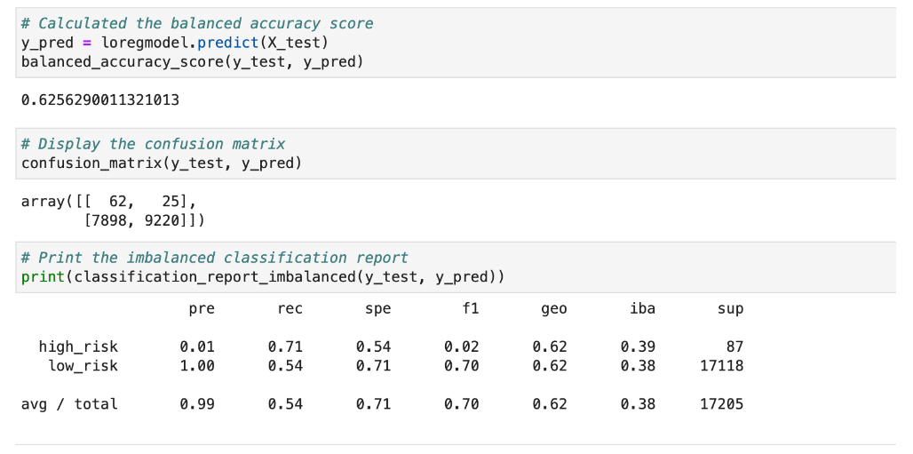
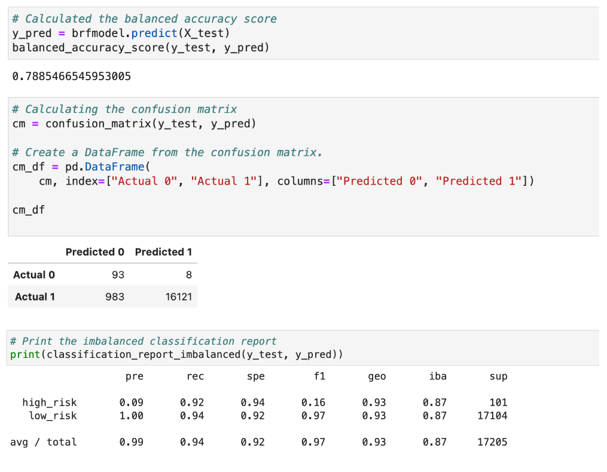
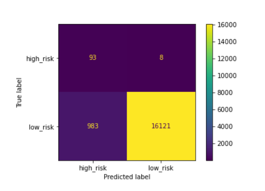
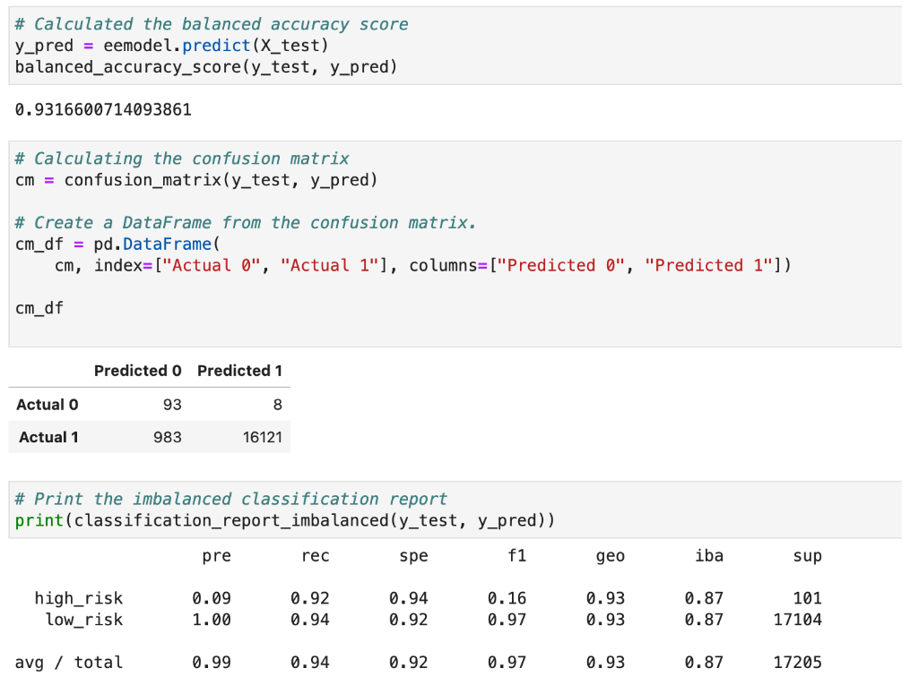

# Credit_Risk_Analysis

## Purpose
Applying machine learning models that reduce bias and help predict credit risk.

## Background
Credit risk is an inherently unbalanced classification problem, as good loans easily outnumber risky loans. Therefore, you’ll need to employ different techniques to train and evaluate models with unbalanced classes. Jill asks you to use imbalanced-learn and scikit-learn libraries to build and evaluate models using resampling.

Using the credit card credit dataset from LendingClub, a peer-to-peer lending services company, you’ll oversample the data using the RandomOverSampler and SMOTE algorithms, and undersample the data using the ClusterCentroids algorithm. Then, you’ll use a combinatorial approach of over- and undersampling using the SMOTEENN algorithm. Next, you’ll compare two new machine learning models that reduce bias, BalancedRandomForestClassifier and EasyEnsembleClassifier, to predict credit risk. Once you’re done, you’ll evaluate the performance of these models and make a written recommendation on whether they should be used to predict credit risk.

## Overview
- Deliverable 1: Use Resampling Models to Predict Credit Risk

- Deliverable 2: Use the SMOTEENN Algorithm to Predict Credit Risk

- Deliverable 3: Use Ensemble Classifiers to Predict Credit Risk

- Deliverable 4: A Written Report on the Credit Risk Analysis (README.md)

## Results

## Random Oversampler

- An accuracy score for the model was calculated to be 63%.
- A confusion matrix was generated.
- An imbalanced classification report has been generated.

The high_risk precision is about 1% only with 56% sensitivity which makes a F1 of 2% only. Due to the large number of the low_risk population, its precision is almost 100% with a sensitivity of 69%.

## SMOTE Oversampling

- An accuracy score for the model was calculated to be 66%.
- A confusion matrix was generated
- An imbalanced classification report has been generated

The high_risk precision is about 1% only with 67% sensitivity which makes a F1 of 2% only. Due to the large number of the low_risk population, its precision is almost 100% with a sensitivity of 66%.

## ClusterCentroids (Undersampling)

- An accuracy score for the model was calculated to be 51%.
- A confusion matrix was generated
- An imbalanced classification report has been generated

The high_risk precision is about 1% only with 57% sensitivity which makes a F1 of 1% only. Due to the large number of the low_risk population, its precision is almost 100% with a sensitivity of 45%.

## SMOTEENN

- An accuracy score for the model was calculated to be 63%.
- A confusion matrix was generated
- An imbalanced classification report has been generated

The high_risk precision is about 1% only with 71% sensitivity which makes a F1 of 2% only. Due to the high number of the low_risk population, its precision is almost 100% with a sensitivity of 54%.

## Balanced Random Forest Classifier

- An accuracy score for the model was calculated to be 79%.
- A confusion matrix was generated.
- An imbalanced classification report has been generated.

The high_risk precision is about 9% with 92% sensitivity which makes a F1 of 16% only. Due to the lower number of the low_risk population, its precision is almost 100% with a sensitivity of 94%.

## Easy Ensemble AdaBoost Classifier

- An accuracy score for the model was calculated to be 93%.
- A confusion matrix was generated.
- An imbalanced classification report has been generated.

The high_risk precision is about 9% with 92% sensitivity which makes a F1 of 16% only. Due to the lower number of the low_risk population, its precision is almost 100% with a sensitivity of 94%.

## Summary

The resampling models did not generate an acceptable model to predict high risk credit(low f1 scores less than 0.08).However the Easy Ensemble Classifier model shows the best results with balance accuracy score of 93% a precison rate of 9% , and sensitivity rate (recall) at 92% compared to the other models.Therefore, the Easy Emsemble Classifier is the best model to use for this type of analysis.It is important to note that the original dataset has a greater number of data that is classified as low-risk compared to high-risk this may skew the results.
